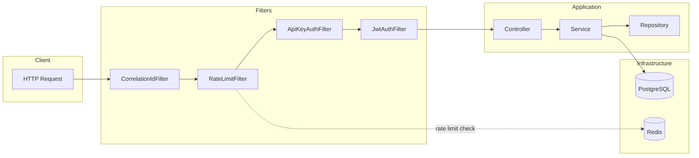
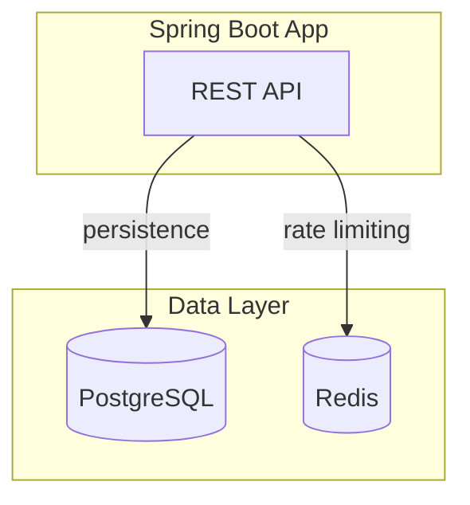
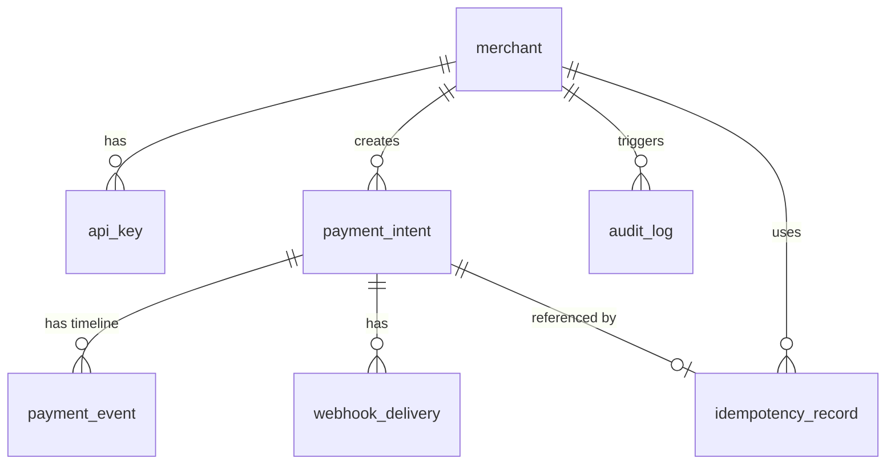
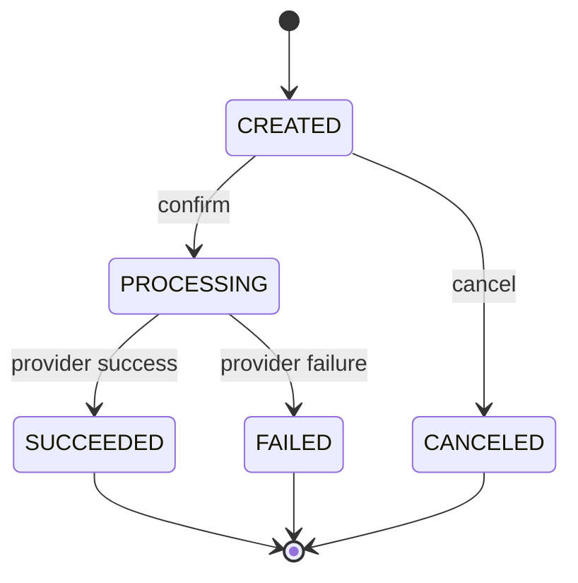

# Payment Processing API

A portfolio-grade **Stripe-lite Payment Processing REST API** built with Spring Boot 3.4 (Java 21) for banks and fintech applications. Supports server-to-server payment processing with a merchant self-service dashboard. (Spring Boot 4 support can be added when ecosystem dependencies are fully compatible.)

## Tech Stack

| Layer | Technology |
|-------|------------|
| Runtime | Java 21 |
| Framework | Spring Boot 3.4 |
| Database | PostgreSQL 16 |
| Cache | Redis 7 |
| Migrations | Flyway |
| Auth | JWT (jjwt), BCrypt |
| API Docs | SpringDoc OpenAPI 3 |
| Testing | JUnit 5, Testcontainers |

## Overview

This API supports:

- **Merchant registration/login** (JWT)
- **Payment intents** (authorize → confirm → capture)
- **Canceling payments**
- **Asynchronous provider callbacks** (webhook simulation)
- **Idempotency** to prevent double-charging
- **Ledger/audit trail** for every state change
- **Rate limiting** per API key (Redis)

---

## Architecture

### Request Flow



### Authentication

| Endpoint Type | Auth Method | Use Case |
|---------------|-------------|----------|
| `/api/auth/*` | None (public) | Register, login |
| `/api/apikeys/*`, `/api/events/*`, `/api/admin/*` | **JWT** (Bearer token) | Dashboard, merchant self-service |
| `/api/payment_intents/*` | **API Key** (X-API-KEY header) | Server-to-server payment processing |
| `/api/webhooks/*` | None (or shared secret) | Provider callbacks |

### Infrastructure



---

## Data Model



| Table | Description |
|-------|-------------|
| `merchant` | Merchants with bcrypt password hash |
| `api_key` | API keys (prefix + hash), scoped to merchant, status (ACTIVE/REVOKED) |
| `payment_intent` | Core payment entity: amount, currency, status, idempotency keys, optimistic locking (`version`) |
| `payment_event` | Event timeline per intent: INTENT_CREATED, CONFIRM_REQUESTED, SUCCEEDED, FAILED, CANCELED |
| `idempotency_record` | Idempotency keys + SHA-256 payload hash for CREATE/CONFIRM operations |
| `audit_log` | Audit trail for all actions (actor, action, details) |
| `webhook_delivery` | Webhook delivery tracking (status, attempts) |

---

## Payment Flow

### State Machine



Valid transitions:

- `CREATED` → `PROCESSING`, `CANCELED`
- `PROCESSING` → `SUCCEEDED`, `FAILED`
- Terminal states: `SUCCEEDED`, `FAILED`, `CANCELED`
- Cancel not allowed after `SUCCEEDED`

### Two Execution Paths

1. **Synchronous simulation** (dev): With `payment.provider.simulate-success=true`, confirm immediately transitions to SUCCEEDED or FAILED without waiting for a provider.
2. **Async webhook**: Provider calls `/api/webhooks/provider` with `providerPaymentId` and `status`; the intent is updated when the webhook arrives.

### Idempotency

- **Create**: Optional `Idempotency-Key` header. If provided, duplicate requests with the same key return the original response; different payload returns 409 Conflict.
- **Confirm**: Required `Idempotency-Key` header. Same rules; prevents double-charging on retries.
- Payload hash (SHA-256) ensures replay with a different body is rejected.

### Optimistic Locking

`PaymentIntent` uses `@Version` for optimistic locking. Concurrent confirm requests on the same intent are handled safely; one succeeds, others retry or return the current state.

---

## API Reference

| Endpoint | Method | Auth | Description |
|----------|--------|------|-------------|
| `/api/auth/register` | POST | None | Register merchant |
| `/api/auth/login` | POST | None | Login, returns JWT |
| `/api/apikeys` | POST | JWT | Create API key |
| `/api/payment_intents` | POST | API Key | Create intent (optional Idempotency-Key) |
| `/api/payment_intents/{id}/confirm` | POST | API Key | Confirm (required Idempotency-Key) |
| `/api/payment_intents/{id}/cancel` | POST | API Key | Cancel intent |
| `/api/payment_intents/{id}` | GET | API Key | Get intent |
| `/api/payment_intents` | GET | API Key | List intents (status, from, to, page, size) |
| `/api/webhooks/provider` | POST | None | Provider callback (SUCCEEDED/FAILED) |
| `/api/events/payment_intents/{id}` | GET | JWT | Payment event timeline |
| `/api/admin/audit` | GET | JWT | Audit logs (paginated) |

**Swagger UI**: `http://localhost:8080/swagger-ui.html`

---

## Security & Production-Ready Features

| Feature | Implementation |
|---------|----------------|
| **Dual auth** | JWT for dashboard (human), API Key for server-to-server (machine); aligns with Stripe's model |
| **Idempotency** | SHA-256 payload hash; 409 Conflict if same key + different body |
| **Rate limiting** | Redis-backed, per API key prefix, 60 req/min (configurable), 429 + Retry-After |
| **Audit trail** | Every state change logged to `audit_log` |
| **Correlation ID** | `X-Request-Id` for request tracing (MDC) |
| **Validation** | Bean Validation on DTOs; global exception handler with field errors |

---

## Design Decisions

| Decision | Rationale |
|----------|-----------|
| **Two auth mechanisms** | Dashboard (human) vs integrations (machine); different security profiles |
| **Idempotency on create and confirm** | Prevents double-charging on retries; confirm is critical for payment |
| **Redis for rate limiting** | Sliding window, shared across instances, low latency |
| **Flyway** | Versioned schema, reproducible deployments |
| **Optimistic locking** | Handles concurrent confirms on same intent safely |

---

## Project Structure

```
src/main/java/com/payment/
├── config/          # Security, OpenAPI, filters (CorrelationId, RateLimit)
├── controller/      # Auth, ApiKey, PaymentIntent, Webhook, Admin
├── domain/          # JPA entities
├── dto/             # Request/response DTOs
├── exception/       # Custom exceptions + GlobalExceptionHandler
├── repository/      # JPA repositories
├── security/        # JwtAuthFilter, ApiKeyAuthFilter, MerchantContext
└── service/         # Business logic (PaymentIntent, Idempotency, Audit, RateLimit)
```

---

## How to Run

### Prerequisites

- Java 21
- Maven 3.9+
- Docker & Docker Compose

### 1. Start Infrastructure

```bash
docker-compose up -d
```

### 2. Run the Application

```bash
./mvnw spring-boot:run
```

The API runs at `http://localhost:8080`. Swagger UI: `http://localhost:8080/swagger-ui.html`

### 3. Run Tests

```bash
./mvnw test
```

Tests use Testcontainers (Postgres + Redis).

---

## Sample cURL Flow

### 1. Register

```bash
curl -X POST http://localhost:8080/api/auth/register \
  -H "Content-Type: application/json" \
  -d '{"name":"Acme Corp","email":"acme@example.com","password":"securepass123"}'
```

### 2. Login

```bash
curl -X POST http://localhost:8080/api/auth/login \
  -H "Content-Type: application/json" \
  -d '{"email":"acme@example.com","password":"securepass123"}'
```

Response: `{"accessToken":"eyJhbGciOiJIUzI1NiJ9..."}`

### 3. Create API Key

```bash
export JWT="<accessToken from login>"
curl -X POST http://localhost:8080/api/apikeys \
  -H "Authorization: Bearer $JWT"
```

Response: `{"id":1,"apiKey":"pk_xxxx...","keyPrefix":"pk_xxxx","message":"Store this key securely..."}`

**Save the `apiKey` – it is shown only once.**

### 4. Create Payment Intent

```bash
export API_KEY="<apiKey from step 3>"
export IDEM_KEY=$(uuidgen)

curl -X POST http://localhost:8080/api/payment_intents \
  -H "X-API-KEY: $API_KEY" \
  -H "Idempotency-Key: $IDEM_KEY" \
  -H "Content-Type: application/json" \
  -d '{"amount":100.50,"currency":"SEK","description":"Order #123"}'
```

### 5. Confirm Payment

```bash
export INTENT_ID="<id from create response>"
export CONFIRM_IDEM=$(uuidgen)

curl -X POST http://localhost:8080/api/payment_intents/$INTENT_ID/confirm \
  -H "X-API-KEY: $API_KEY" \
  -H "Idempotency-Key: $CONFIRM_IDEM" \
  -H "Content-Type: application/json" \
  -d '{"paymentMethodType":"CARD","paymentMethodToken":"tok_test_visa"}'
```

### 6. Simulate Webhook (Provider Callback)

```bash
export PROVIDER_PAYMENT_ID="<providerPaymentId from confirm response>"

curl -X POST http://localhost:8080/api/webhooks/provider \
  -H "Content-Type: application/json" \
  -d '{"providerPaymentId":"'$PROVIDER_PAYMENT_ID'","status":"SUCCEEDED"}'
```

### 7. Get Payment Intent

```bash
curl -X GET "http://localhost:8080/api/payment_intents/$INTENT_ID" \
  -H "X-API-KEY: $API_KEY"
```

### 8. List Payment Events (JWT)

```bash
curl -X GET "http://localhost:8080/api/events/payment_intents/$INTENT_ID" \
  -H "Authorization: Bearer $JWT"
```

---

## Configuration

| Property | Default | Description |
|----------|---------|-------------|
| `jwt.secret` | (dev default) | JWT signing key (256-bit) |
| `jwt.expiration-ms` | 86400000 | JWT expiry (24 hours) |
| `rate-limit.requests-per-minute` | 60 | Per API key |
| `rate-limit.window-seconds` | 60 | Rate limit window |
| `payment.provider.simulate-success` | true | Dev: always succeed |
| `payment.provider.simulate-timeout-ms` | 5000 | Simulated provider delay |
| `webhook.provider-secret` | (dev default) | Shared secret for webhooks |
| `api-key.prefix-length` | 8 | API key prefix length |
| `api-key.key-length` | 32 | API key length |

**Environment variables**: `JWT_SECRET`, `WEBHOOK_SECRET` override defaults.

---

## Production Checklist

- Set `JWT_SECRET` and `WEBHOOK_SECRET` to strong, unique values
- Set `payment.provider.simulate-success=false` for real provider integration
- Configure PostgreSQL and Redis for production (connection pooling, persistence)
- Enable HTTPS and secure headers

---

## Error Responses

All errors return consistent JSON:

```json
{
  "timestamp": "2025-02-16T12:00:00Z",
  "status": 400,
  "error": "Bad Request",
  "message": "Validation failed",
  "path": "/api/payment_intents",
  "fieldErrors": [{"field": "amount", "message": "Amount must be at least 0.01"}]
}
```

---

## Testing

```bash
./mvnw test
```

| Type | Tests | Notes |
|------|-------|-------|
| **Unit** | `PaymentStateMachineTest`, `IdempotencyTest` | State transitions, idempotency logic |
| **Integration** | `PaymentFlowIntegrationTest`, `IdempotencyIntegrationTest`, `RateLimitIntegrationTest`, `ConcurrencyIntegrationTest` | Testcontainers (PostgreSQL + Redis) |

Requires Docker for Testcontainers. Core flows can also be verified via the cURL examples above.
